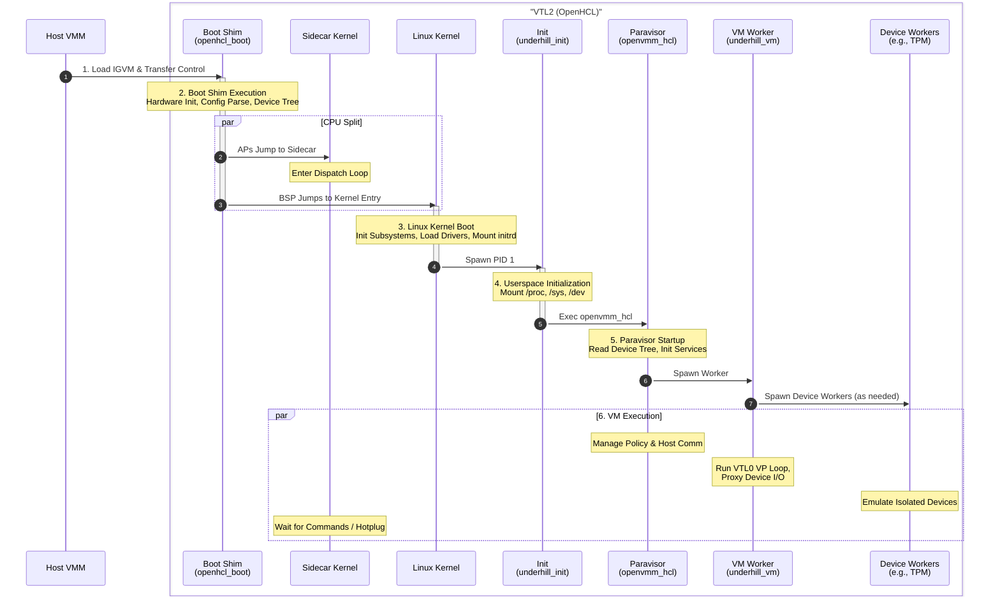

# OpenHCL Boot Flow

This page follows OpenHCL from IGVM loading through the `openhcl_boot` shim,
Linux startup, and the running `openvmm_hcl` paravisor.

## 1. IGVM Loading

The boot process begins when the host VMM loads the OpenHCL IGVM image into
VTL2 memory. The image contains the initial code and data required to start the
paravisor, including the boot shim, kernel, and initial ramdisk.

The host places components at addresses described by IGVM directives and
supplies launch-time data such as processor topology, VTL2 memory, serial
configuration, and device settings. The image distinguishes measured static
configuration from dynamic host data.

## 2. Boot Shim Execution (`openhcl_boot`)

The host transfers control to the entry point of the **Boot Shim**.

1. **Hardware Init:** The shim initializes CPU state and the memory management
     unit (MMU).
2. **Config Parsing:** It parses configuration from multiple sources:
    * **Contents of the IGVM image**, including:
            * **Measured parameters:** Fixed parameters encoded into the measured
                section of the IGVM image and loaded by the host.
        * **Command Line:** The kernel command line supplied through the IGVM or
            host device tree.
        * **Host Device Tree:** Host-provided topology and resource information.
3. **New Device Tree:** It constructs the hardware description passed to Linux.
4. **Sidecar Setup (x86_64):** It assigns processors to Linux or sidecar,
     initializes control structures, and starts sidecar application processors.
        * **Sidecar Entry:** Sidecar CPUs jump to the sidecar kernel rather than
            Linux.
5. **Kernel Handoff:** The BSP and selected APs enter Linux with the final
     device tree, command line, and architecture-specific boot data.

### Measured and host-provided inputs

The shim combines several input classes:

- Measured parameters generated with the IGVM, including component addresses,
    imported regions, initrd metadata, and static command-line options.
- A host device tree describing launch-time topology and resources.
- Architecture and isolation state observed at runtime.
- Optional servicing state that controls CPU and memory restoration.

For a non-isolated image, host configuration can be trusted according to the
normal VTL contract. For a hardware-isolated image, the shim accepts host data
only through the fields and policy permitted by the measured image.

## 3. Linux Kernel Boot

The Linux kernel takes over on the BSP and initializes the operating-system
environment. Sidecar CPUs remain in their dispatch loop until Linux hot-plugs
them.

1. **Kernel Init:** The kernel initializes its subsystems (memory, scheduler, etc.).
2. **Driver Init:** It loads drivers for the paravisor hardware and standard devices.
3. **Root FS:** It mounts the initial ramdisk (initrd) as the root filesystem.
4. **User Space:** It spawns the first userspace process, `underhill_init` (PID 1).

## 4. Userspace Initialization (`underhill_init`)

`underhill_init` prepares the userspace environment.

1. **Filesystems:** It mounts pseudo-filesystems such as `/proc`, `/sys`, and
    `/dev`.
2. **Environment:** It sets up environment variables and system limits.
3. **Exec:** It replaces itself with the main paravisor process, `/bin/openvmm_hcl`.

## 5. Paravisor Startup (`openvmm_hcl`)

The paravisor process (`openvmm_hcl`) starts and initializes virtualization
services.

1. **Config Discovery:** It reads topology and configuration from
    `/proc/device-tree` and other kernel interfaces.
2. **Service Init:** It initializes VTL0 management, host communication, and
    other internal services.
3. **Worker Spawn:** It starts `underhill_vm` for the high-performance VM data
    path.

`openvmm_hcl` remains the policy and control-plane process after spawning the
worker. See the dedicated [`openvmm_hcl`](./openvmm_hcl.md) page for its
resource, worker, servicing, and diagnostic responsibilities.

## 6. VM Execution

At this point, the OpenHCL environment is fully established.

The `underhill_vm` process runs the VTL0 guest, handles exits, and coordinates
device emulation. Security-sensitive devices such as the virtual TPM can run in
dedicated worker processes. The VM worker proxies I/O and guest-memory access
between VTL0 and those workers.

Meanwhile, `openvmm_hcl` manages the overall policy and communicates with the host.
